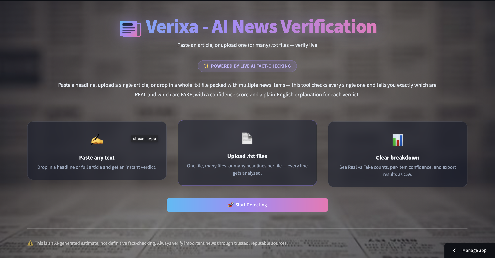
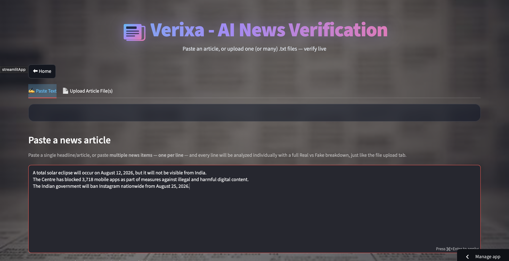
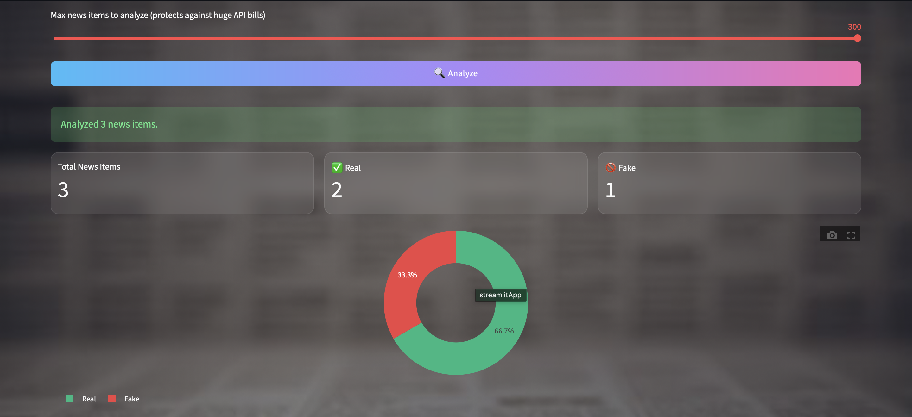
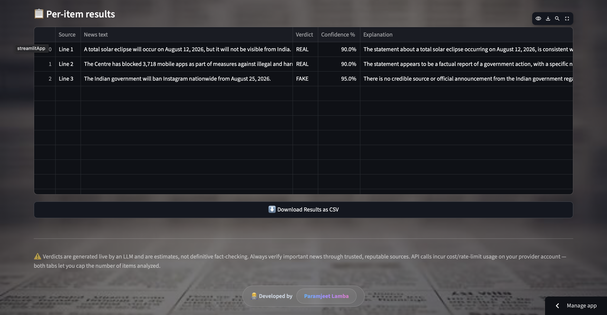
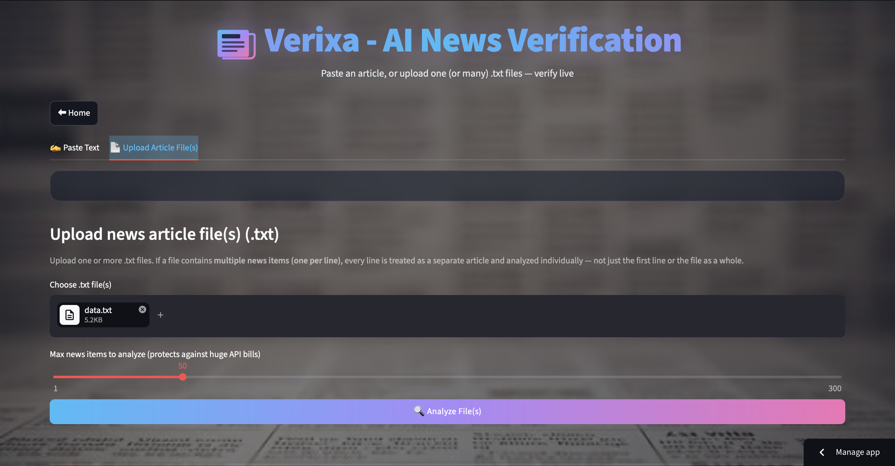
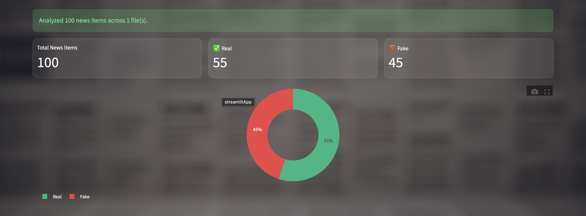
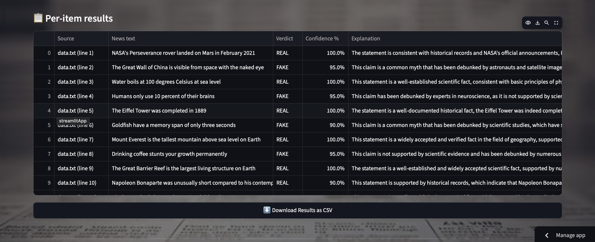

# 📰 Verixa — AI News Verification System

**Paste it. Upload it. Verify it.**

Verixa is an AI-powered news verification application built with **Streamlit and Groq LLaMA 3.3** that analyzes news headlines and articles in real time. It classifies content as **REAL** or **FAKE** and provides a confidence score along with a plain-English explanation for each result.

### 🚀 Live Demo

**Try Verixa:** https://real-vs-fake-news-detector-aiml.streamlit.app


---

## ✨ Overview

Misinformation can spread rapidly through online platforms, making it difficult to determine whether a news article is trustworthy.

**Verixa** provides an AI-powered verification layer that analyzes submitted news content and generates:

* ✅ REAL or ❌ FAKE classification
* 🎯 Confidence score from 0–100%
* 💡 Plain-English explanation
* 📊 Batch analysis and visual statistics
* 📥 CSV export of analysis results

Users can paste a single headline/article, analyze multiple news items, or upload `.txt` files for batch processing.

---

## 🚀 Features

| Feature                 | Description                                                                     |
| ----------------------- | ------------------------------------------------------------------------------- |
| ✍️ **Text Analysis**    | Paste a single headline/article or multiple news items for individual analysis. |
| 📄 **File Upload**      | Upload one or multiple `.txt` files for automated news analysis.                |
| 🎯 **Confidence Score** | Generates a 0–100% confidence score for every prediction.                       |
| 💡 **AI Explanation**   | Provides a plain-English explanation behind each REAL/FAKE verdict.             |
| 📊 **Batch Analysis**   | Displays Real vs Fake counts with an interactive pie chart and results table.   |
| ⬇️ **CSV Export**       | Export analyzed news results for reporting, research, or record keeping.        |
| 🔐 **Secure API Keys**  | API credentials are managed securely using Streamlit Secrets.                   |
| 🎨 **Modern UI**        | Custom dark-themed interface with newspaper-inspired visuals and animations.    |

---

## 🧠 How Verixa Works

```text
                    ┌─────────────────────┐
                    │   News Input        │
                    │ Text / .txt File    │
                    └──────────┬──────────┘
                               │
                               ▼
                    ┌─────────────────────┐
                    │ News Item Processing│
                    │ & Batch Splitting   │
                    └──────────┬──────────┘
                               │
                               ▼
                    ┌─────────────────────┐
                    │ Groq LLaMA 3.3 70B  │
                    │ AI Analysis         │
                    └──────────┬──────────┘
                               │
                               ▼
                    ┌─────────────────────┐
                    │ Structured JSON     │
                    │ Verdict + Confidence│
                    │ + Explanation       │
                    └──────────┬──────────┘
                               │
                ┌──────────────┼──────────────┐
                ▼              ▼              ▼
          REAL / FAKE     Confidence      Explanation
                               │
                               ▼
                    ┌─────────────────────┐
                    │ Results Dashboard    │
                    │ Charts + Table       │
                    └──────────┬──────────┘
                               │
                               ▼
                         CSV Export
```

Each news item is sent to the LLM using a dedicated fact-checking system prompt. The model returns a structured JSON response:

```json
{
  "verdict": "FAKE",
  "confidence": 87,
  "explanation": "The article contains sensational claims and patterns commonly associated with misinformation."
}
```

---

## 📸 Screenshots

### 1. Home Page



### 2. News Detection — Text Input







### 3. News Detection — File Upload







---

## 🛠️ Tech Stack

### Frontend & Application

* **Python 3.11**
* **Streamlit** — Web application framework

### AI & LLM

* **Groq API** — LLM inference
* **LLaMA 3.3 70B** — AI-powered news analysis

### Data Processing

* **Pandas** — Data processing, result tables, and CSV export
* **Plotly** — Interactive charts and confidence visualizations

### Security & Deployment

* **Streamlit Secrets** — Secure API key management
* **Streamlit Cloud** — Application deployment

### Supported AI Providers

The application architecture can also be adapted to other AI providers such as:

* Groq
* Gemini
* OpenAI

The active provider can be configured through the application configuration.

---

## ⚙️ Getting Started

### 1. Clone the Repository

```bash
git clone https://github.com/Paramjeet-Lamba/Fake-News-Detector.git
cd Fake-News-Detector
```

### 2. Install Dependencies

```bash
pip install -r requirements.txt
```

### 3. Configure API Key

Create:

```text
.streamlit/secrets.toml
```

Add your Groq API key:

```toml
GROQ_API_KEY = "your-groq-api-key-here"
```

**Never commit your API key to GitHub.**

### 4. Run Verixa

```bash
streamlit run app.py
```

The application will be available at:

```text
http://localhost:8501
```

---

## 📁 Project Structure

```text
Verixa/
│
├── app.py
├── requirements.txt
├── README.md
│
├── Images/
│   ├── 01_Detector.png
│   ├── 02_Detector.png
│   ├── 03_Detector.png
│   ├── 04_Detector.png
│   ├── 05_Detector.png
│   ├── 06_Detector.png
│   └── 07_Detector.png
│
└── .streamlit/
    ├── secrets.toml
    └── secrets.toml.example
```

---

## 🧪 Usage

### Step 1 — Start Verifying

Open Verixa and click **Start Detecting**.

### Step 2 — Select Input Method

Choose between:

**✍️ Paste Text**

* Enter one news article/headline.
* Or enter multiple news items, one per line.

**📄 Upload Article File(s)**

* Upload one or multiple `.txt` files.
* Multi-line files are automatically processed into individual news items.

### Step 3 — Analyze

Click **Analyze** to send the news content for AI-powered verification.

### Step 4 — Review Results

For every news item, Verixa provides:

* REAL / FAKE verdict
* Confidence percentage
* AI-generated explanation

### Step 5 — Export Results

For batch analysis, download the complete results as a **CSV file**.

---

## 🔐 Security

Verixa uses **Streamlit Secrets** to protect API credentials.

API keys are:

* ❌ Not displayed in the application interface
* ❌ Not hard-coded into the source code
* ❌ Not committed to GitHub
* ✅ Loaded securely through Streamlit Secrets

The `.streamlit/secrets.toml` file should remain private and must be included in `.gitignore`.

---

## ⚠️ Important Disclaimer

Verixa uses an LLM to generate news verification estimates.

The results are **not guaranteed to be definitive factual conclusions** and should not be treated as a replacement for professional journalism or trusted fact-checking organizations.

Always verify important information using reliable and reputable sources before making decisions based on the result.

---

## 🔮 Future Improvements

Potential improvements for future versions include:

* 🌐 Multi-language news verification
* 🔎 Source credibility analysis
* 📰 Integration with trusted news sources
* 🌍 Real-time web-based fact checking
* 🧩 Browser extension
* 📱 Mobile-friendly application
* 📈 Historical verification analytics
* 🤖 Additional LLM providers
* 🧠 Retrieval-Augmented Generation (RAG)
* 🔗 Citation and source verification

---

## 🤝 Contributing

Contributions, issues, and feature requests are welcome.

If you have an idea that can improve Verixa, feel free to open an issue or submit a pull request.

---

## 📄 License

This project is licensed under the **MIT License**.

---

<p align="center">

### 📰 Verixa

**AI-Powered News Verification System**

*Verify information. Understand the verdict.*

Built with ❤️ using **Python, Streamlit & Groq LLaMA 3.3**

</p>
